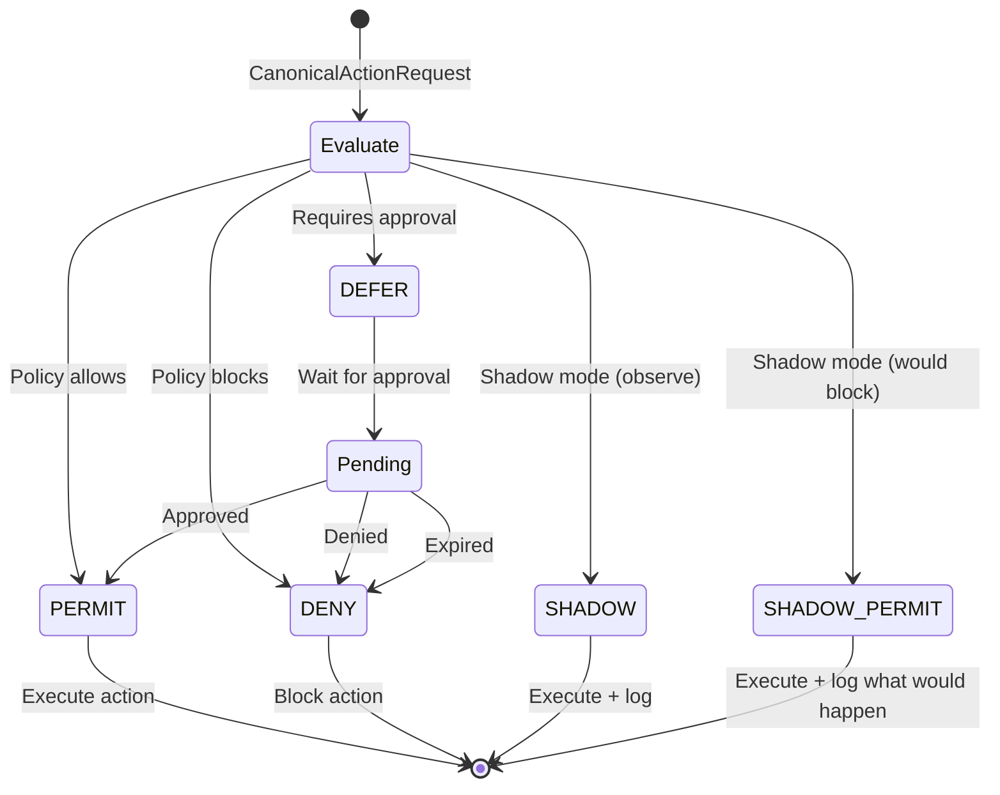

## Overview

`Effect` is the outcome of a governance decision. It is a string constant that determines how the Faramesh runtime enforces the policy decision.

```go
type Effect string
```

## Effect Constants

<ResponseField name="PERMIT" type="Effect">
  Action is **allowed** and will be executed.
  
  The agent tool call proceeds normally. This is the successful authorization outcome.
</ResponseField>

<ResponseField name="DENY" type="Effect">
  Action is **blocked** and will not be executed.
  
  The agent receives a denial with:
  - A human-readable `reason`
  - A `denial_token` for operator lookup (oracle attack prevention)
  - A `retry_permitted` flag indicating if the denial is categorical or state-dependent
  
  <Note>
  Faramesh fails **closed** by default. Any governance infrastructure failure results in `DENY`.
  </Note>
</ResponseField>

<ResponseField name="DEFER" type="Effect">
  Action requires **human approval** before execution.
  
  The agent receives:
  - A `defer_token` to poll for approval status
  - A `defer_expires_at` timestamp when the request auto-denies
  - A suggested `defer_poll_interval_secs`
  
  The agent must call `check_approval(defer_token)` to discover when the approval resolves.
</ResponseField>

<ResponseField name="SHADOW" type="Effect">
  Action is **monitored** but not enforced.
  
  Used for policy testing without blocking production agents. The action is logged and observed, but always proceeds.
  
  <Info>
  `SHADOW` is useful when rolling out new policies. You can observe what would be blocked without impacting agent operations.
  </Info>
</ResponseField>

<ResponseField name="SHADOW_PERMIT" type="Effect">
  Action is **allowed** in shadow mode, but would have been blocked in enforcement mode.
  
  The [Decision](/api/decision) includes `shadow_actual_outcome` indicating what would have happened (typically `DENY` or `DEFER`).
  
  This enables A/B testing of policy changes and safe policy rollouts.
</ResponseField>

## Effect State Machine

The governance pipeline produces one of five effects for every [CanonicalActionRequest](/api/canonical-action-request):



## When Each Effect Is Used

<Expandable title="PERMIT" defaultOpen={true}>
  **Used when:**
  - Policy rules explicitly allow the action
  - All budget constraints are satisfied
  - No approval workflows are triggered
  - Context validation passes
  
  **Example:** A customer service agent issuing a refund under $100 when daily budget allows.
</Expandable>

<Expandable title="DENY">
  **Used when:**
  - Policy rules explicitly forbid the action
  - Budget limits are exceeded
  - Tool is restricted for this agent/principal
  - Default deny (no matching rules)
  - Governance infrastructure fails (fail-closed)
  
  **Example:** An agent attempting to delete production data, or monthly API quota exceeded.
</Expandable>

<Expandable title="DEFER">
  **Used when:**
  - Policy requires human approval for this action
  - Action exceeds automatic authorization thresholds
  - High-risk operations that need oversight
  
  **Example:** Refund over $500 requires manager approval, or database schema changes require DBA review.
</Expandable>

<Expandable title="SHADOW">
  **Used when:**
  - Policy is in observation mode
  - Testing new policy rules without enforcement
  - Gathering data for policy tuning
  
  **Example:** Rolling out a new budget policy and observing which actions would be affected.
</Expandable>

<Expandable title="SHADOW_PERMIT">
  **Used when:**
  - Shadow mode is enabled AND
  - The policy would have blocked/deferred the action in enforcement mode
  
  **Example:** A new policy would deny an action, but you want to allow it while collecting metrics on false positives.
</Expandable>

## Constants in Code

From `internal/core/types.go`:

```go
const (
    EffectPermit       Effect = "PERMIT"
    EffectDeny         Effect = "DENY"
    EffectDefer        Effect = "DEFER"
    EffectShadow       Effect = "SHADOW"
    EffectShadowPermit Effect = "SHADOW_PERMIT"
)
```

## Related Types

- [Decision](/api/decision) - Contains the `effect` field and outcome metadata
- [CanonicalActionRequest](/api/canonical-action-request) - The input evaluated to produce an Effect
