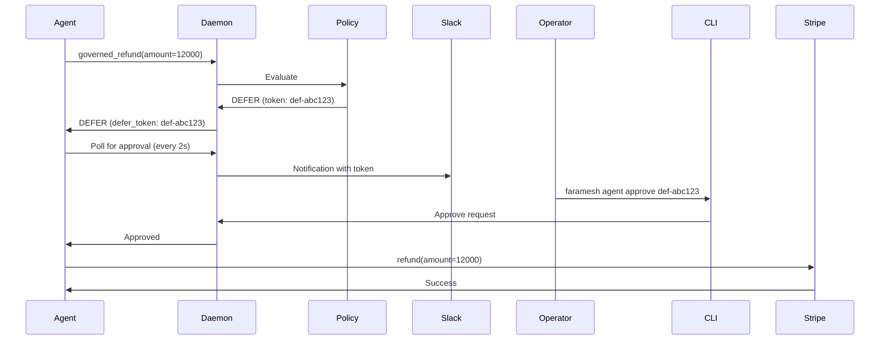

## Overview

The `faramesh agent` command group provides fleet management operations: approving or denying deferred actions and activating emergency kill switches.

## Commands

### `faramesh agent approve`

Approve a pending DEFER action.

```bash
faramesh agent approve <defer-token>
```

**What it does:**
- Connects to the running daemon via Unix socket
- Sends an approval for the specified DEFER token
- The daemon unblocks the waiting agent, allowing the tool call to proceed

**Example:**
```bash
$ faramesh agent approve def-abc123
✓ DEFER token def-abc123 approved
```

**Workflow:**

1. Agent calls a governed tool (e.g., `stripe_refund(amount=12000)`)
2. Policy evaluates the call and returns `DEFER` with a token
3. SDK blocks and waits for approval (polls every 2 seconds)
4. Operator runs: `faramesh agent approve def-abc123`
5. SDK unblocks, tool executes

<ParamField path="defer-token" type="string" required>
  DEFER token from the decision response. Format: `def-<random>`.
</ParamField>

<ParamField path="--socket" type="string" default="/tmp/faramesh.sock">
  Daemon Unix socket path.
</ParamField>

---

### `faramesh agent deny`

Deny a pending DEFER action.

```bash
faramesh agent deny <defer-token>
```

**What it does:**
- Connects to the running daemon via Unix socket
- Sends a denial for the specified DEFER token
- The daemon unblocks the waiting agent with a `DeferredError`

**Example:**
```bash
$ faramesh agent deny def-abc123
✓ DEFER token def-abc123 denied
```

**In the agent:**
```python
try:
    result = governed_refund(amount=12000)
except DeferredError as e:
    print(f"DEFER denied: {e.reason}")
    # Handle denial (log, notify, retry later, etc.)
```

<ParamField path="defer-token" type="string" required>
  DEFER token from the decision response. Format: `def-<random>`.
</ParamField>

<ParamField path="--socket" type="string" default="/tmp/faramesh.sock">
  Daemon Unix socket path.
</ParamField>

---

### `faramesh agent kill`

Activate kill switch for an agent — all subsequent calls will DENY.

```bash
faramesh agent kill <agent-id>
```

**What it does:**
- Sets a per-agent kill switch flag (atomic boolean)
- All subsequent tool calls from this agent will be denied immediately
- Bypasses policy evaluation entirely
- Used for emergency shutdowns

**Example:**
```bash
$ faramesh agent kill payment-bot
⚡ Kill switch activated for agent: payment-bot
All subsequent calls from this agent will be DENIED.
```

**Use cases:**

<CardGroup cols={2}>
  <Card title="Runaway agent" icon="ban">
    Agent is making unexpected or dangerous calls. Kill switch stops it immediately.
  </Card>
  <Card title="Compromised credentials" icon="key">
    Agent credentials may be compromised. Kill switch prevents further damage while you investigate.
  </Card>
  <Card title="Budget exceeded" icon="dollar-sign">
    Agent has exceeded cost budget. Kill switch prevents additional spend.
  </Card>
  <Card title="Security incident" icon="shield">
    Security alert triggered. Kill switch isolates the agent during incident response.
  </Card>
</CardGroup>

<Warning>
  The kill switch is **permanent for the current daemon session**. To re-enable the agent, restart the daemon or implement policy-based kill switch deactivation.
</Warning>

<ParamField path="agent-id" type="string" required>
  Agent identifier (e.g., `payment-bot`, `ops-agent-1`).
</ParamField>

<ParamField path="--socket" type="string" default="/tmp/faramesh.sock">
  Daemon Unix socket path.
</ParamField>

---

## DEFER Workflow

Faramesh implements human-in-the-loop governance via the DEFER effect:



**Timeouts:**

- Default DEFER timeout: **5 minutes**
- After timeout, the SDK raises `DeferredError` with `expired=True`
- The agent can retry, escalate, or abort

**Notifications:**

Configure Slack webhook for DEFER notifications:

```bash
faramesh serve --policy policy.yaml \
  --slack-webhook https://hooks.slack.com/services/T00000000/B00000000/XXXXXXXXXXXXXXXXXXXX
```

Slack message:

```
🟡 DEFER — stripe/refund (amount=$12,000)
Agent: payment-bot
Session: session-xyz
Reason: refund exceeds threshold — requires finance approval

Approve: faramesh agent approve def-abc123
Deny: faramesh agent deny def-abc123
```

---

## Kill Switch Behavior

When a kill switch is activated:

1. **Immediate effect**: All subsequent calls from the agent are denied
2. **Bypass policy**: Policy evaluation is skipped entirely
3. **DPR record**: Each denied call is recorded with `reason_code=KILL_SWITCH_ACTIVE`
4. **In-flight calls**: Calls already in progress are **not** terminated
5. **Session state**: Session counters and history are still updated

**Example DPR record:**

```json
{
  "record_id": "rec-xyz789",
  "agent_id": "payment-bot",
  "tool_id": "stripe/refund",
  "effect": "DENY",
  "reason": "kill switch activated for agent",
  "reason_code": "KILL_SWITCH_ACTIVE",
  "matched_rule_id": ""
}
```

---

## Monitoring Deferred Actions

To see pending DEFER actions:

```bash
faramesh audit tail --agent payment-bot
```

Look for:

```
[10:20:15] DEFER   stripe/refund          payment-bot       rule=defer-high-value  5ms
```

The defer token is logged by the daemon:

```json
{"level":"info","agent":"payment-bot","defer_token":"def-abc123","msg":"DEFER decision issued"}
```

---

## Programmatic Approval

You can approve/deny DEFER tokens programmatically by connecting to the Unix socket:

```python
import socket
import json

def approve_defer(token: str, socket_path: str = "/tmp/faramesh.sock"):
    sock = socket.socket(socket.AF_UNIX, socket.SOCK_STREAM)
    sock.connect(socket_path)
    
    request = {
        "type": "approve_defer",
        "defer_token": token,
        "approved": True,
        "reason": "approved by automated workflow"
    }
    
    sock.sendall((json.dumps(request) + "\n").encode())
    response = json.loads(sock.recv(4096).decode())
    sock.close()
    
    return response["ok"]

# Approve a deferred action
approve_defer("def-abc123")
```

---

## Related Commands

- [`faramesh serve`](/cli/serve) — Start the daemon
- [`faramesh audit tail`](/cli/audit) — Stream live decisions (including DEFER)
- [`faramesh policy test`](/cli/policy) — Test a policy to see if it generates DEFER
