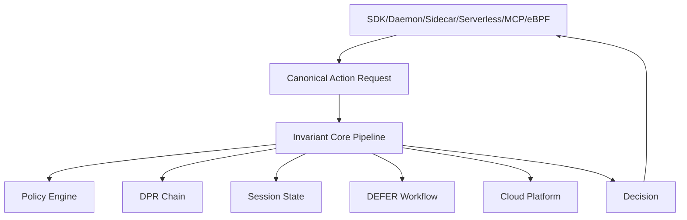

## The Architecture Principle

Every successful infrastructure control plane — Terraform, Vault, Datadog, OPA — was built on one architecture decision: **unified core + thin adapters**. Terraform has one HCL language and thin provider adapters. Vault has one core and pluggable backends. Faramesh follows the same model.

<Note>
A developer who writes a Faramesh policy for their notebook has already learned everything needed to govern their production Kubernetes fleet. Only the adapter changes — and `faramesh init` selects it automatically.
</Note>

## The Invariant Core

Faramesh's architecture is built around an **invariant core** that runs identically regardless of which adapter delivers the request. This ensures consistent governance across all environments.



The invariant core contains:

- **Policy Engine**: YAML + expr-lang evaluation (~1μs per rule)
- **DPR Chain**: Tamper-evident Decision-Provenance Record audit log
- **Session State**: In-memory counters, history ring buffer, budget tracking
- **DEFER Workflow**: Human-in-the-loop approval channel parking
- **Cloud Platform**: Optional sync to Faramesh Cloud for fleet management

Every adapter's only job is to:
1. Translate its environment into a `CanonicalActionRequest` (CAR)
2. Send the CAR to the invariant core
3. Act on the `Decision` returned

## The 6 Adapter Modes

Faramesh auto-detects your environment and selects the appropriate adapter:

<CardGroup cols={2}>
  <Card title="A1: SDK Shim" icon="code">
    Python/JS/Go/TypeScript decorator pattern. Under 60 seconds to first governance.
  </Card>
  <Card title="A2: Local Daemon" icon="server">
    Unix socket + broker. Works everywhere, no network required.
  </Card>
  <Card title="A3: Sidecar + Proxy" icon="network-wired">
    Transparent HTTP/gRPC interception. Network-level isolation.
  </Card>
  <Card title="A4: Serverless" icon="bolt">
    Lambda layers, Cloud Run handlers. Zero infrastructure.
  </Card>
  <Card title="A5: MCP Gateway" icon="gateway">
    Faramesh IS the MCP server. One-line client config change.
  </Card>
  <Card title="A6: eBPF" icon="linux">
    Kernel-level syscall interception on Linux (optional).
  </Card>
</CardGroup>

## Architecture Diagram

```
┌──────────────────────── FARAMESH INVARIANT CORE ────────────────────────┐
│  Policy Engine │ DPR Chain │ Session State │ DEFER Workflow │ Cloud     │
│  (YAML+expr)   │ (WAL-first│               │ (channel park) │ Platform  │
└────────────────────────────────┬────────────────────────────────────────┘
                                 │ CanonicalActionRequest + DPR write
                                 │ (same format regardless of adapter)
┌────────────────────────────────▼────────────────────────────────────────┐
│                  ADAPTER STACK (auto-selected per environment)           │
│                                                                          │
│  A1: SDK Shim          A2: Local Daemon       A3: Sidecar + Proxy       │
│  Python/JS/Go/TS       Unix socket + broker   Transparent HTTP/gRPC     │
│  <60 sec on-ramp       Works everywhere       Network isolation         │
│                                                                          │
│  A4: Serverless        A5: MCP Gateway        A6: eBPF (optional)      │
│  Lambda/Cloud Run      Faramesh IS the MCP    Kernel-level on Linux     │
└────────────────────────────────┬────────────────────────────────────────┘
                                 │
┌────────────────────────────────▼────────────────────────────────────────┐
│  faramesh init --auto-detect                                             │
│  Detects K8s → Helm chart + NetworkPolicy + sidecar                     │
│  Detects Lambda → layer ARN + env var template                          │
│  Detects Jupyter → pip install + govern() snippet                       │
│  Detects MCP → client config change (one line)                          │
└──────────────────────────────────────────────────────────────────────────┘
```

## Auto-Detection

Faramesh automatically detects your environment and configures the appropriate adapter:

<Steps>
  <Step title="Run faramesh init">
    ```bash
    faramesh init --auto-detect
    ```
  </Step>
  
  <Step title="Environment Detection">
    Faramesh inspects:
    - K8s cluster? → Generates Helm chart + NetworkPolicy + sidecar injector
    - AWS Lambda? → Provides layer ARN + environment variable template
    - Jupyter notebook? → Shows `pip install faramesh` + `govern()` snippet
    - MCP client? → Outputs one-line client config change
    - Local dev? → Starts daemon on Unix socket
  </Step>
  
  <Step title="Apply Configuration">
    Follow the generated instructions to activate governance in your environment.
  </Step>
</Steps>

## Pipeline Stages

Every governance decision flows through an 11-step pipeline (see [pipeline.go:108-312](https://github.com/faramesh/faramesh-core/blob/main/internal/core/pipeline.go:108)):

<Accordion title="View All 11 Pipeline Stages">
  1. **Kill switch check** — Atomic boolean per agent_id (nanoseconds)
  2. **Phase check** — Tool visibility in current workflow phase
  3. **Pre-execution scanners** — Shell, secret, PII detection (parallel goroutines)
  4. **Session state read** — sync.Map counters + ring buffer
  5. **History ring read** — Last N calls within T seconds
  6. **External selector fetch** — Lazy, parallel, cached, timeout-bounded
  7. **Policy evaluation** — expr-lang bytecode, first-match-wins, ~1μs/rule
  8. **Decision** — PERMIT | DENY | DEFER | SHADOW
  9. **WAL write** — fsync to local disk BEFORE returning decision
  10. **Async replication** — Replicate to SQLite DPR, update session + history
  11. **Return Decision** — Back to adapter
</Accordion>

<Warning>
**WAL Ordering Invariant**: If step 9 (WAL write) fails → the decision is DENY. If the process crashes between steps 9 and 10, the WAL replays on restart. **No gap in the audit chain is possible.**
</Warning>

## Canonical Action Request

Every adapter normalizes requests into a `CanonicalActionRequest` (CAR v1.0):

```go
type CanonicalActionRequest struct {
    CallID           string         // UUID v4 for idempotency
    AgentID          string         // Agent identity
    SessionID        string         // Session grouping
    ToolID           string         // e.g. "stripe/refund"
    Args             map[string]any // Tool arguments
    Timestamp        time.Time      // When adapter received call
    InterceptAdapter string         // "sdk" | "proxy" | "mcp" | "ebpf"
    Principal        *Identity      // Optional: human/system identity
    Delegation       *DelegationChain // Optional: delegation context
}
```

See [types.go:25-59](https://github.com/faramesh/faramesh-core/blob/main/internal/core/types.go:25) for the complete definition.

## Benefits of This Architecture

<CardGroup cols={2}>
  <Card title="Learn Once, Run Anywhere" icon="rocket">
    Write a policy in your notebook. Deploy it to production Kubernetes with zero changes.
  </Card>
  
  <Card title="Consistent Behavior" icon="check-double">
    The same policy evaluates identically whether you're using SDK, sidecar, or eBPF.
  </Card>
  
  <Card title="Adapter Independence" icon="puzzle-piece">
    Swap adapters without changing policies. Migrate from SDK to sidecar with no policy edits.
  </Card>
  
  <Card title="Tamper-Proof Audit" icon="shield">
    Every decision is recorded in the DPR chain before execution, regardless of adapter.
  </Card>
</CardGroup>

## Internal Package Structure

The invariant core lives in `internal/core/`:

```
internal/core/
├── pipeline.go          Main governance pipeline (WAL-first, atomic)
├── types.go             Core types (CanonicalActionRequest, Decision)
├── policy/              Policy engine (YAML + expr-lang)
├── dpr/                 Decision-Provenance Record chain
├── defer/               DEFER workflow (park, poll, approve/deny)
├── session/             Session state management
└── observe/             Observability and telemetry
```

See the [full package map](https://github.com/faramesh/faramesh-core#internal-package-map) for details.